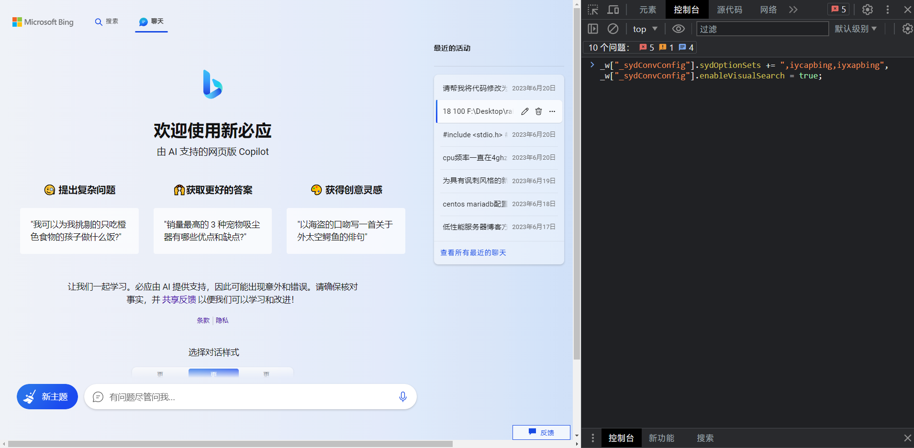
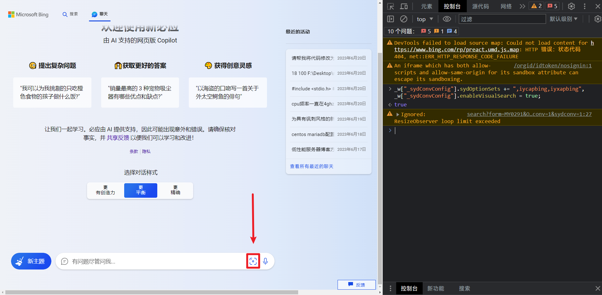
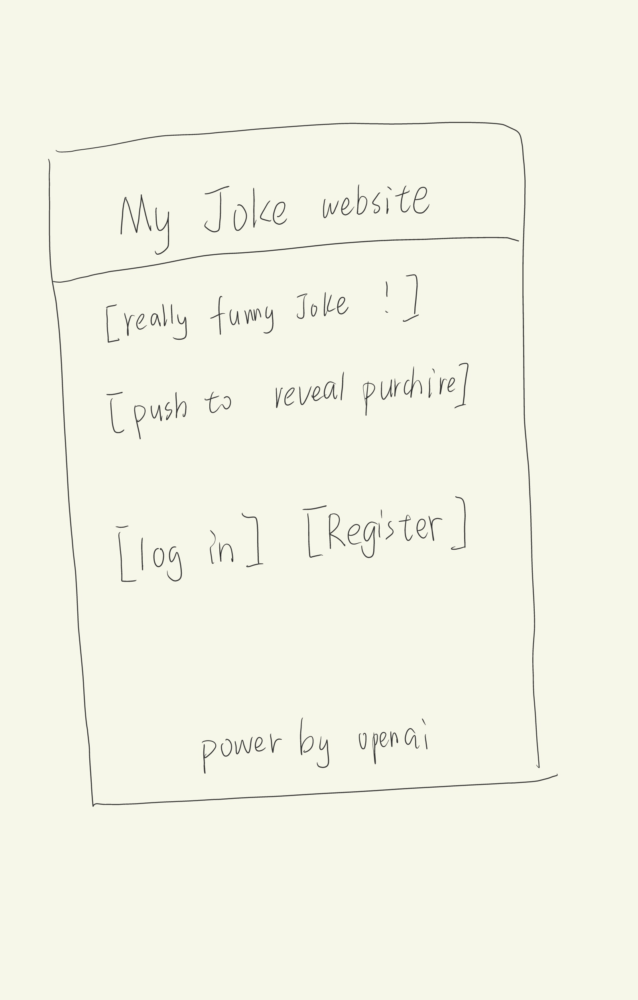
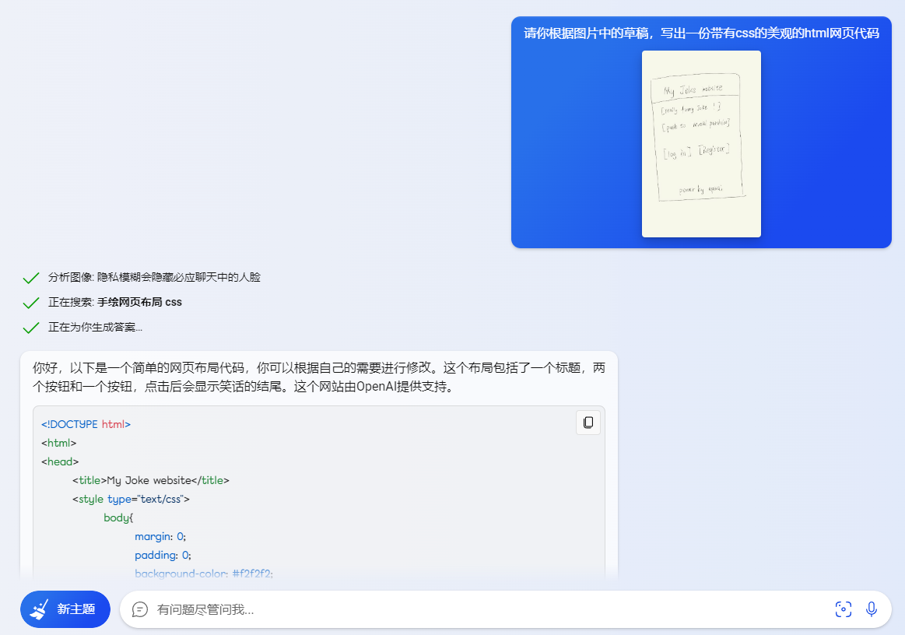
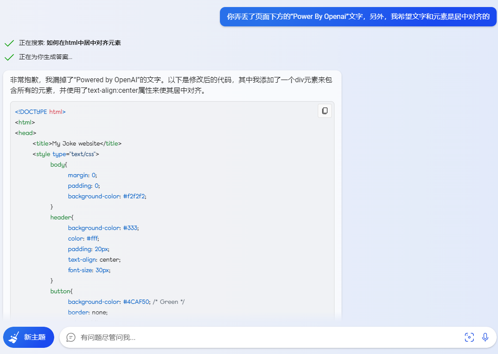
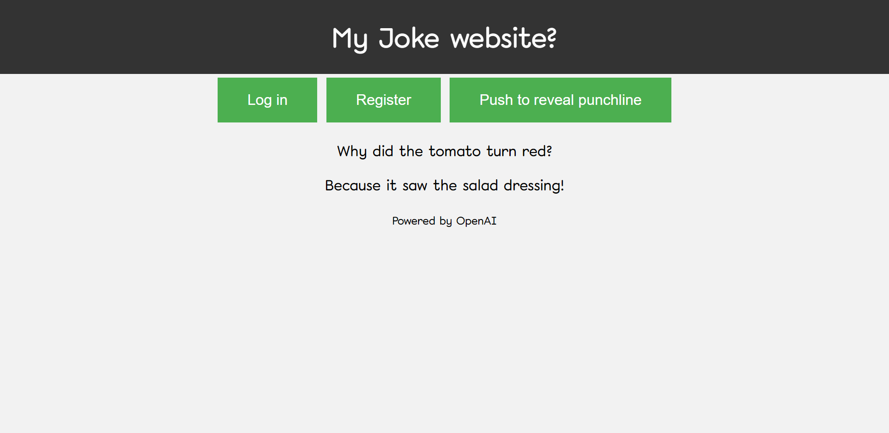

# Using-GPT4-image-recognition-on-NewBing

## 如题，这是一个教你如何解锁NewBing的GPT4识图能力的教程。
甚至可以实现类似GPT-4发布会上，发送手写草稿图片，让ai生成网站代码的“魔法”功能。尽管可能没有100%实现预期效果，但我觉得这已经很不错了，充满了可玩性等待开发。

首先，让我们简单了解下原理，NewBing基于GPT-4，其实已经包含了图片识别的功能，但是目前还未开放，我们需要做的就是在浏览器的控制台中执行代码，来打开这个隐藏功能。下面我将演示：

## 步骤：

### 1.打开浏览器，进入NewBing页面，使用f12调出控制台。



### 2.在控制台中输入以下代码，此时先不要运行：

```
_w["_sydConvConfig"].sydOptionSets += ",iycapbing,iyxapbing",
_w["_sydConvConfig"].enableVisualSearch = true;
```

### 3.刷新网页，在网页还未加载完成前，按下Enter运行代码。



### 此时NewBing对话框将出现传图功能，你可以上传网络/本地图像给NewBing，并给她下达命令。


### 以下是我的演示，基本复刻GPT-4发布会上画的“大饼”😁

测试用图（平板手写）如下：





第一次生成的网页缺少了元素，同时元素没有对齐，于是我继续添加需求：



html文件在项目文件夹中可供查看，以下为最终界面预览：



可以看到，NewBing基本实现了我们的需求，我们也可以继续提出需求，改到满意为止。

### 另外，这里推荐一个在Chrome上解锁NewBing的小扩展，让你不再被Edge绑架😃
[Chrome Unlock New Bing AI](https://chrome.google.com/webstore/detail/chrome-unlock-new-bing-ai/nglhdhdfndbadmaiieikpefenkbgpdbf)
